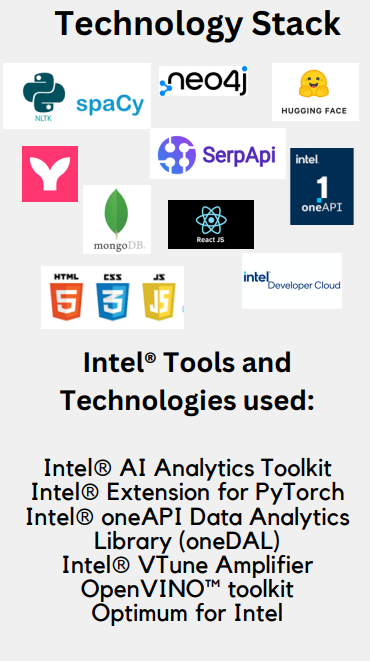

# Synapse: Research Intelligence

Synapse is an advanced research intelligence tool that utilizes cutting-edge technologies and methodologies to provide user-centric research input with sophisticated analysis capabilities.

## Features

- **User-Centric Research Input**: Users can input and refine research topics through an intuitive interface, supported by Intel® oneTBB for efficient data handling and parallel processing.
- **Ethical Data Acquisition**: Systematic scraping of research articles from reputable sources using Intel® AI Analytics Toolkit and Intel® Extension for PyTorch.
- **Advanced NLP Techniques**: Utilizes advanced NLP for query refinement and comprehensive literature coverage, ensuring high-quality control with Intel® oneDAL.
- **Structured Data with Knowledge Graphs**: Employs NLP to construct knowledge graphs, optimizing data representation and storage with Optimum for Intel.
- **Deep Learning for Summary Generation**: Integrates fine-tuned LLMs and OpenVINO™ toolkit for optimized data analysis and report generation.
- **Enhanced User Experience**: Offers an ethical, interactive experience with transparent sourcing, bias mitigation, and performance optimization using Intel® VTune Amplifier.
- **Continuous Improvement**: Incorporates feedback and leverages the Intel® oneAPI ecosystem for responsive updates and improvements.

## Technology Stack

Stay tuned for updates!
